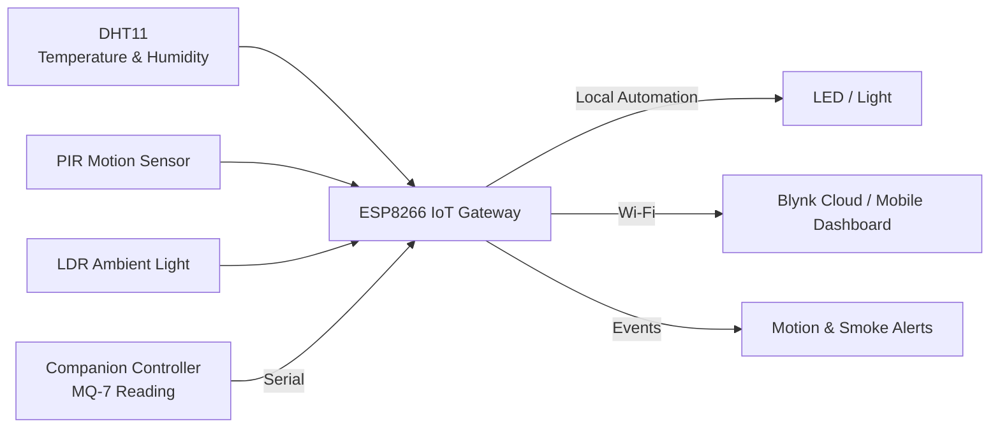

# IoT Home Automation & Monitoring System

An ESP8266-based IoT home-monitoring prototype that combines environmental sensing, motion detection, gas/smoke monitoring, automatic lighting, serial sensor integration, and Blynk-based remote telemetry.

The project was built around a simple idea: collect useful information from the home environment, automate basic responses locally, and make sensor status and safety events available remotely through a mobile IoT dashboard.

## What the System Does

- Monitors **temperature and humidity** using a DHT11 sensor
- Detects **motion** using a PIR sensor
- Measures **ambient light** using an LDR
- Automatically switches an LED/light according to ambient brightness
- Receives **MQ-7 gas/smoke readings** from a companion controller over serial communication
- Sends live sensor values to the **Blynk IoT platform**
- Generates Blynk events for **motion** and **smoke/gas threshold detection**
- Uses non-blocking periodic sensor updates so the IoT connection remains responsive

## System Architecture



The ESP8266 acts as the connected gateway. It reads the sensors assigned directly to it, receives the gas-sensor value over serial, performs the ambient-light automation locally, and publishes telemetry and events to Blynk.

## Hardware

| Component | Purpose |
|---|---|
| ESP8266 | Wi-Fi connectivity, sensor processing and Blynk communication |
| Arduino / companion controller | Sends the MQ-7 gas reading to the ESP8266 over serial |
| DHT11 | Temperature and humidity sensing |
| PIR sensor | Motion detection |
| LDR | Ambient-light sensing |
| MQ-7 | Gas/smoke sensing |
| LED / light output | Automatic lighting demonstration |

## Blynk Data Mapping

| Virtual Pin | Data |
|---|---|
| V1 | MQ-7 gas/smoke reading |
| V5 | Temperature |
| V6 | Humidity |
| V7 | Ambient-light reading |
| V8 | PIR motion state |

The firmware uses the Blynk event names:

```text
motion_detected
smoke_detected
```

These events should be created in the corresponding Blynk template before running the system.

## Automatic Lighting

The LDR is sampled through the ESP8266 analog input. When the measured light level falls below the configured threshold, the output light is switched on. When the environment becomes brighter, it is switched off.

The threshold is kept as a configurable constant in the firmware so it can be tuned for the physical sensor placement and lighting conditions.

## Safety Monitoring

The gas/smoke value is compared with a configurable threshold. A Blynk event is generated when the value crosses into the alert state.

The firmware uses state-based alert handling so the same event is not continuously logged on every sensor update while the condition remains active.

Motion alerts work in the same way: an event is generated when motion begins rather than being repeatedly triggered for every loop iteration.

## Firmware

The maintained firmware is located at:

```text
firmware/esp8266_gateway/esp8266_gateway.ino
```

The cleaned implementation keeps the behavior of the original prototype while improving the software structure:

- removes conflicting direct use of `A0` for both the LDR and MQ-7;
- keeps `A0` dedicated to the LDR;
- receives the MQ-7 reading over the serial link already present in the original design;
- removes duplicate gas-sensor telemetry;
- replaces the blocking one-second delay with `BlynkTimer`;
- prevents repeated motion and smoke event flooding;
- validates DHT readings before publishing them;
- keeps configuration values such as thresholds and temperature offset in one place.

## Configuration

Before uploading the firmware, enter the Blynk authentication token and Wi-Fi credentials:

```cpp
char auth[] = "YOUR_BLYNK_AUTH_TOKEN";
char ssid[] = "YOUR_WIFI_SSID";
char pass[] = "YOUR_WIFI_PASSWORD";
```

The Blynk template ID and template name are also defined near the top of the sketch.

The companion controller should send the MQ-7 reading as an integer followed by a newline:

```text
287
```

The ESP8266 parses each complete line and uses the latest received value for telemetry and smoke-threshold monitoring.

## Required Libraries

Install the following through the Arduino IDE Library Manager:

- **Blynk**
- **DHT sensor library**

ESP8266 board support must also be installed in the Arduino IDE.

## Running the Project

1. Wire the DHT11, PIR sensor, LDR and LED according to the pin definitions in the firmware.
2. Connect the serial output carrying the MQ-7 reading to the ESP8266 serial input, using appropriate logic-level compatibility.
3. Configure the Blynk template, virtual pins and events.
4. Add Wi-Fi and Blynk credentials to the firmware.
5. Upload `esp8266_gateway.ino` to the ESP8266.
6. Open the Blynk dashboard and verify live sensor values.
7. Test the ambient-light automation, motion event and smoke threshold.

## Repository Structure

```text
iot-home-automation-monitoring-system/
├── README.md
├── .gitignore
├── firmware/
│   └── esp8266_gateway/
│       └── esp8266_gateway.ino
└── docs/
    ├── architecture.md
    └── hardware-and-setup.md
```

## Project Scope

This repository documents the surviving and verifiable IoT-monitoring portion of the original prototype. The available firmware supports environmental monitoring, motion detection, ambient-light automation, serial gas-sensor input and Blynk telemetry/events.

The project is intended as an embedded/IoT prototype rather than a production home-security or safety system.
