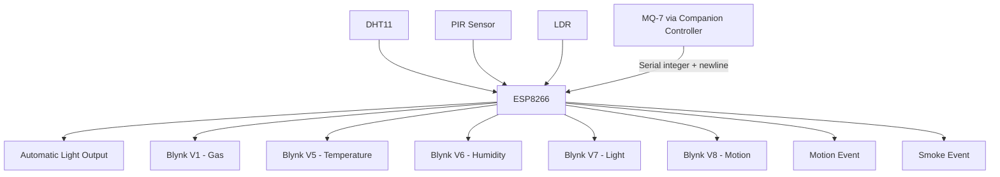

# System Architecture

## Overview

The project uses the ESP8266 as the connected IoT gateway. Its responsibilities are divided into four parts:

1. **Local sensing**
   - DHT11 for temperature and humidity
   - PIR sensor for motion
   - LDR for ambient light

2. **Serial sensor integration**
   - The latest MQ-7 reading is received as an integer over the serial connection from a companion controller.
   - This avoids assigning multiple analog sensors to the ESP8266 `A0` input.

3. **Local automation**
   - The LDR value is compared with a configured light threshold.
   - The LED/light output is switched automatically.

4. **Cloud monitoring**
   - Sensor values are written to Blynk virtual pins.
   - Motion and gas/smoke conditions generate Blynk events.

## Data Flow



## Firmware Scheduling

The main loop is intentionally small:

```text
Blynk.run()
timer.run()
readSerialGasValue()
```

Periodic sensing and telemetry are handled by `BlynkTimer` rather than by a blocking delay. This keeps the firmware responsive to the Blynk connection while sensor updates continue at a fixed interval.

## Alert Logic

Motion and gas/smoke alerts are state based.

For example, a smoke event is generated only when the system changes from the normal state to the alert state. The event is not logged again until the reading first returns below the threshold and later crosses it again.
